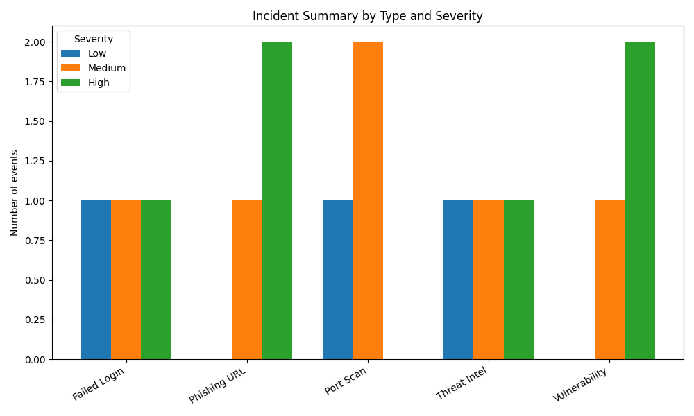

# Incident Analysis & Reporting Dashboard

This project consolidates security alerts and scan outputs from multiple tools into a single summary. It demonstrates how to normalise incident data and visualise it for analysts.

## Features

The dashboard is designed to make incident data easy to consume and explore.  Key features include:

- **Data aggregation** – Ingest CSV logs from port scanners, log parsers and threat‑intel feeds.  V3 adds support for reading data from standard input (`-`), which allows piping logs from other tools or streaming sources.
- **Summary statistics** – Compute counts by event type and severity and print a console summary.  Optionally generate daily counts and other breakdowns.
- **Visualisation** – Produce grouped bar charts summarising incidents by type/severity and by date.  Charts are saved as PNG files for inclusion in reports.
- **Drill‑down analysis** – Identify the top IP addresses associated with high severity events and correlate events by IP and event type to see which hosts generate which kinds of alerts.
- **Interactive CLI** – Launch an interactive menu (`--interactive`) to explore summaries, daily breakdowns, top IPs and correlation tables without re‑running the script.
- **Streaming & scaling** – Read from STDIN for on‑the‑fly processing of large or continuous log streams.  Internal operations use pandas, which can be scaled to chunked processing for very large datasets.
- **Packaging & deployment** – A `setup.py` and `requirements.txt` allow installation via `pip`, and a `Dockerfile` provides an isolated runtime.  The included GitHub Actions workflow runs linting and unit tests on every push.

## Getting started

There are multiple ways to run the dashboard depending on your preferred environment:

1. **Install from source**: Clone this repository and install the dependencies using the bundled `setup.py`:

   ```bash
   git clone https://github.com/<your-​username>/incident-analysis-dashboard.git
   cd incident-analysis-dashboard
   # install the package in editable mode so the entry point is available
   pip install -e .
   ```

   After installation, a console script named `incident-dashboard` will be available in your `PATH`.  You can run it with:

   ```bash
   incident-dashboard sample_logs.csv summary.png
   ```

   The above command generates a bar chart summarising events by type and severity and writes it to `summary.png`.  Additional options allow you to save a daily chart and list the top high‑severity IP addresses:

   ```bash
   incident-dashboard sample_logs.csv summary.png \
       --daily-output daily.png --top-high 3
   ```

   To explore the data interactively, supply the `--interactive` flag.  You will be presented with a menu to view summaries, daily counts, top IPs and correlation tables:

   ```bash
   incident-dashboard sample_logs.csv summary.png --interactive
   ```

   You can also pipe data from another process by using `-` as the input file:

   ```bash
   cat sample_logs.csv | incident-dashboard - summary.png
   ```

2. **Run with Docker**: Build the container image and run the tool without installing anything locally:

   ```bash
   docker build -t incident-dashboard .
   docker run --rm -v $(pwd):/data incident-dashboard \
       /data/sample_logs.csv /data/summary.png --daily-output /data/daily.png
   ```

   The volume mount makes your local directory available inside the container so that input logs can be read and output charts can be written.

3. **Extend the schema**: The CSV schema is intentionally simple—each row should at least include `timestamp`, `event_type` and `severity`.  You can add additional columns such as `ip`, `user`, `source` or `description`.  The loader and analysis functions will ignore extra columns by default, but you can customise them to incorporate more complex relationships.

## Files

- `incident_dashboard.py` – the original proof‑of‑concept script with basic summary and plotting.
- `incident_dashboard_v2.py` – improved CLI script supporting daily summaries and top‑IP analysis.
- `incident_dashboard_v3.py` – further enhanced script adding interactive menus, correlation tables and streaming input support.
- `sample_logs.csv` – example dataset with simulated incidents.
- `incident_chart.png` – sample output bar chart used in the README.
- `test_incident_dashboard.py` – unit tests verifying input validation and summary counts.
- `requirements.txt` – minimal list of Python dependencies.
- `setup.py` – packaging metadata enabling installation via `pip` and registering the `incident-dashboard` entry point.
- `Dockerfile` – container specification for running the dashboard in isolation.
- `.github/workflows/python.yml` – CI workflow that runs linting and tests on each commit.

## Sample output

The following bar chart illustrates a sample incident summary generated from the `sample_logs.csv` dataset:



## Roadmap & backlog

This project started as a proof‑of‑concept and has evolved into a more capable tool thanks to contributions such as the v2 and v3 scripts.  There is still plenty of headroom for further enhancements:

- **Threat‑intel enrichment** – Integrate with services like VirusTotal, AbuseIPDB or OTX to enrich IP addresses or hashes with reputation information.
- **Real‑time ingestion** – Extend streaming support to read from message queues (Kafka, AWS Kinesis, etc.) or tail log files, and process data in incremental batches.
- **Web dashboard** – Develop a lightweight Flask or FastAPI web interface that allows users to upload log files, explore interactive charts and view correlation tables without using the command line.
- **Advanced analytics** – Incorporate anomaly detection, trend analysis and correlation of events across multiple dimensions (user, host, geo‑location).
- **Report generation & alerts** – Produce HTML/PDF reports summarising findings and allow automated alerting via Slack or email when thresholds are exceeded.
- **Packaging & distribution** – Publish a versioned release to PyPI and maintain Docker images on Docker Hub for easy consumption.
- **Continuous integration & quality** – The existing GitHub Actions workflow runs `flake8` and `pytest`.  Future work may add static type checking (mypy) and coverage reporting.

Issues and feature requests are tracked in the repository’s Issues and Projects boards.  Contributions are welcome!
